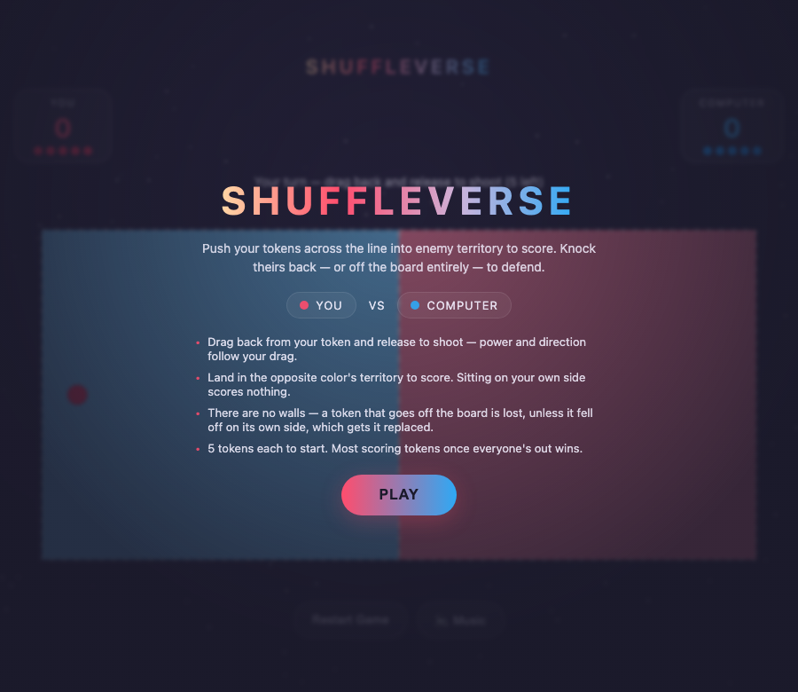
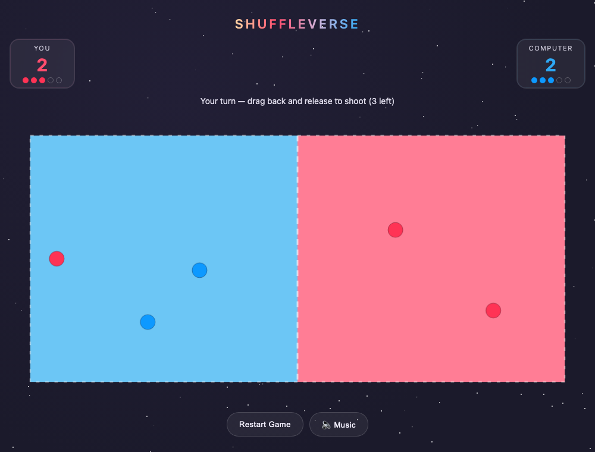

# Shuffleverse

A browser-based physics game inspired by the pub game Shuffle (and shuffleboard/curling) — push tokens across the board into your side to score, or knock the opponent's tokens off the board. Built with plain HTML5 canvas and vanilla JS, no dependencies, no build step.




Play it by opening `index.html` in a browser, or serve the folder locally:

```bash
python3 -m http.server 8080
```

then visit `http://localhost:8080`.

## How to play

- Hit **Play** on the title screen to start.
- The board is a rectangle split down the middle: blue (left) is the computer's side, red (right) is yours.
- You (**red**) and the **computer** (blue) each start with 5 tokens.
- On your turn, drag back from your token — like a slingshot — and release to shoot. Drag distance sets power, direction sets aim, and an arrow shows exactly where the shot will go.
- Push a token across the center line into the *opposite* color's territory to score a point for it. Land too many of your own tokens on your own side and they just sit there — no score.
- You can also shoot to knock the opponent's tokens around, including back across the line to cancel their point, or clean off the board.
- There are no walls — the whole edge of the board is open. A token that goes off the board is lost, *unless* it went off on its own owner's side, in which case that player gets a replacement token to make up for it.
- Turns alternate. After a full stop and a short pause, play passes to the other side. The computer waits for everything to settle before it moves.
- Each player's remaining tokens are shown as a row of dots next to their score — filled means still in hand, hollow means already played. The dot count grows whenever a bonus token is awarded.
- Whoever has more scoring tokens once both players are out of tokens (and bonus tokens) wins.

The computer isn't purely defensive — it mostly goes for its own points, and only breaks off to knock out one of your tokens some of the time (more often if several of your tokens are scoring at once, or if it's behind).

There's an ambient background music toggle (🔈) in the controls — off by default since browsers block autoplay audio until you interact with the page.

## Tech notes

Everything lives in a single `index.html`: canvas rendering, a small fixed-timestep physics loop (position/velocity integration, circle-circle collisions, point-in-polygon boundary checks), simple turn-state management, a lightweight computer opponent, and a procedurally generated ambient pad synthesized with the Web Audio API (no audio files). No build tooling, no external assets, no dependencies.
